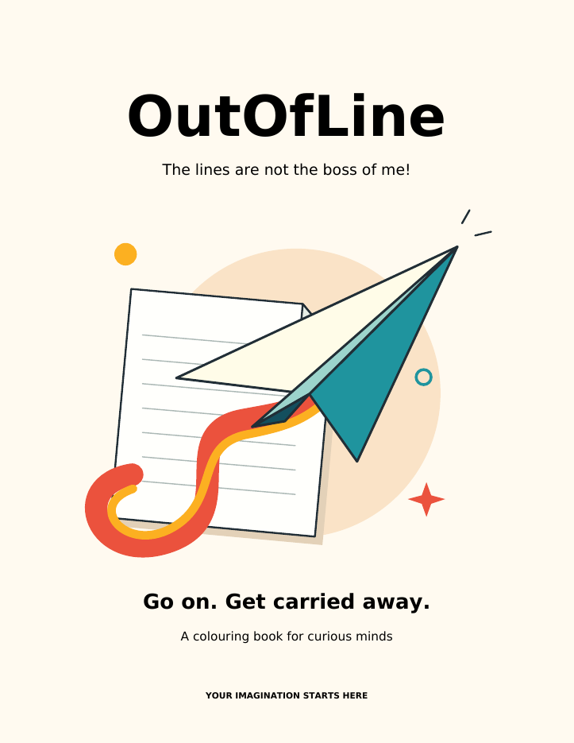

# OutOfLine

**The lines are not the boss of me!**

A colouring book for children aged 4-10 that encourages them to look again,
colour across decorative lines, and invent their own possibilities. Each
illustration has two intended readings: an everyday object in the line drawing,
and another subject revealed through colour. Inspired by Rob Gonsalves' use of
shared contours and visual transformations.



## Read the current book

- [Book with filled colour keys](book/recreated/outofline-colour-key-book.pdf)
- [11-page book PDF](book/recreated/outofline-reconstruction-book.pdf)
- [All seven drawings and colour reveals](book/recreated/outofline-reconstruction-sheets.pdf)
- [Standalone cover PDF](book/recreated/outofline-cover-alternative.pdf)
- [Illustration previews, part 1](book/recreated/recreated-1.png) and [part 2](book/recreated/recreated-2.png)

This is the current review edition. It contains a cover, instructions, seven
colouring pages, and two reveal pages. Each drawing uses seven colour numbers;
children choose their own palette. The working rule is **thick line: stop;
thin line: colour across it**. Children can also colour freely or invent a third
reading.

## The seven transformations

| Page | First reading | Colour reveal | Current state |
| --- | --- | --- | --- |
| 1 | House | Owl | Approved; original geometry and numbering preserved |
| 2 | Umbrella | Jellyfish | Cleaned up; rain restored |
| 3 | Flower | Butterfly | Approved after line cleanup |
| 4 | Sailboat | Fish | Scales contained inside the body; stronger thin mast |
| 5 | Teacup | Hot-air balloon | Approved; steam envelope and cup basket |
| 6 | Tree | Elephant | Leaf cues, joined legs, shorter trunk and tusks |
| 7 | Mountain landscape | Sleeping cat | Selected to replace bookshelf; shared vector contours and seven colours |

The paper-airplane cover is selected for now. Its exact subtitle is
**“The lines are not the boss of me!”**. The cover does not reveal any puzzle.
See [design status](docs/design-status.md) for the decisions to preserve.

## Build locally

Tested with Python 3.12. Native Cairo is **not required** for the current build.

```sh
python3 -m venv .venv
.venv/bin/python -m pip install -r requirements-lock.txt
.venv/bin/python recreate.py
.venv/bin/python cover_alternative.py --output book/recreated/outofline-cover-alternative.pdf
```

`requirements-lock.txt` records the tested package versions. `requirements.txt`
provides version ranges for environments that need different compatible wheels.
On Windows, use `.venv\Scripts\python.exe` in place of `.venv/bin/python`.

The default build destination is `book/recreated/`, resolved relative to the
source directory. An explicit `--output-dir PATH` is also supported. The builder
can be called from a different working directory using its absolute path.
It writes the blank-key book, filled-colour-key book, comparison PDF, and
`region-audit.json`. The filled-key edition uses each illustration's reveal
palette in the seven numbered boxes and adapts the instructions. The drawings
remain uncoloured.

To regenerate the PNG previews, install Poppler and run:

```sh
pdftoppm -scale-to-x 890 -scale-to-y -1 -png book/recreated/outofline-reconstruction-sheets.pdf book/recreated/recreated
pdftoppm -f 1 -l 1 -r 85 -singlefile -png book/recreated/outofline-reconstruction-book.pdf book/recreated/cover
```

To compare against the saved geometry before the reconstruction and cleanup:

```sh
.venv/bin/python recreate.py --saved-geometry --output-dir work/saved-geometry
```

## Verify changes

```sh
.venv/bin/python -m unittest test_reconstruction.py
```

The tests check palette/label identities and exact preservation of the original
owl's number placement. With Poppler installed, a test renders the fish
and checks that scale ink stays inside the visible body. That test is skipped
when Poppler is absent. Also inspect rendered line art and coloured reveals;
tests cannot establish whether both visual readings work for a child. A roster
check also ensures the cat replaces only the bookshelf in the active book.

## Source and documentation

| File | Role |
| --- | --- |
| `recreate.py` | Current CLI, PDF layout, vector rendering and label placement |
| `reference_reconstruction.py` | Reconstructs differences from the supplied prototypes |
| `teacup_balloon.py` | Steam/balloon and cup/basket shared geometry |
| `cleanup.py` | Current line cleanup, clipping metadata and selected refinements |
| `cover_alternative.py` | Active paper-airplane cover; filename retained from its proposal stage |
| `pages/` | Original saved geometry plus the new `p8_cat.py` landscape/cat page |
| `engine.py` | Geometry primitives, original label algorithm and legacy Cairo helpers |
| `fonts/` | Bundled DejaVu fonts and redistribution licence |
| `references/` | The owner's two original prototype contact sheets |
| `book/recreated/` | Current generated PDFs, PNG previews and region audit |

- [Architecture and build details](docs/architecture.md)
- [Design decisions and pending work](docs/design-status.md)
- [Recovery provenance](RECOVERY_NOTES.md)
- [Contributor/agent context](AGENTS.md)

`book.py` and `sheet.py` are historical Cairo entry points with obsolete
machine-specific paths. Use `recreate.py`; those scripts do not produce the
current edition. The former `book/outside-the-lines.pdf` has been superseded
by the linked book in `book/recreated/`.

## Remaining work

The redesigned teacup is approved. The sleeping cat replaces the bookshelf. The bookshelf/city remains a possible future option; fruit bowl/turtle is deferred future work. See [future work](docs/future-work.md). Some small regions
still do not receive a number, and some hidden subjects are apparent before
colouring. The region audit includes tiny raster slivers, so its counts are not
counts of confirmed print defects. Age suitability and the two readings still
need review with children; this is not yet a final production edition.
